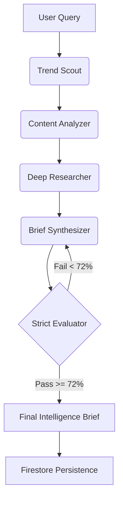

# NicheSignal v5
**Created by Swarnim & Mahi**

**NicheSignal** is a multi-agent AI pipeline designed to automate content gap intelligence for YouTube creators. By scraping the web for trending developer data, clustering the results, deep-researching high-value URLs, and synthesizing a structured brief, the pipeline identifies topics the audience is searching for that aren't being well-served by existing content.

### 🚀 Live Demo
[View Live on Streamlit Cloud](https://nichesignal-f2uh9zfltdcsnbo28tp4p5.streamlit.app/)

### 📺 Video Walkthrough
[Watch the Demo on Loom](https://www.loom.com/share/1888d82059ee40a78d2d6a8ed47e0805)

## ✨ Features

- **Google Authentication:** Secure sign-in using Firebase Auth (Google Provider).
- **Per-User History:** Queries and briefs are saved to individual user collections in Cloud Firestore.
- **Multi-Source Data Collection:** Concurrently scouts Hacker News, GitHub Trending, Stack Overflow, Dev.to, Lobsters, and Google Trends.
- **Semantic Clustering:** Groups signals using `sentence-transformers` (`all-MiniLM-L6-v2`) to identify the strongest overlapping topics.
- **Deep Web Research:** Automatically fetches and extracts the text payload of the most valuable source URLs.
- **Groq-Powered Brief Synthesis:** Uses `llama-3.1-8b-instant` to generate highly specific, structured content briefs (Gap Summary, Technical Roadmap, Hooks).
- **LLM-as-a-Judge Evaluation:** Uses `llama-3.1-8b-instant` as a strict evaluator, scoring the generated brief on a 6-dimension rubric.
- **Dark Editorial UI:** A premium Streamlit dashboard with a sidebar query history, live intelligence feed, and a detailed Plotly scorecard.

## 🏗️ Architecture

The pipeline is orchestrated with **LangGraph**, utilizing a cyclic state machine:



See [PROBLEM_STATEMENT.md](./PROBLEM_STATEMENT.md) for the project background and [SPECIFICATION.md](./SPECIFICATION.md) for the full technical breakdown.

## 🚀 Getting Started

### Prerequisites
- Python 3.10+
- A [Groq API Key](https://console.groq.com/)
- A [Firebase Project](https://console.firebase.google.com/) (for Auth and Firestore)

### Installation

1. **Clone the repo**
   ```bash
   git clone https://github.com/Swarnim0810/NicheSignal.git
   cd NicheSignal
   ```

2. **Install dependencies**
   ```bash
   pip install -r requirements.txt
   ```

3. **Set your environment variables**
   Create a `.env` file for local testing or use Streamlit Secrets for cloud deployment:
   ```toml
   GROQ_API_KEY="your_api_key"
   
   [firebase]
   type = "service_account"
   project_id = "..."
   private_key = "..."
   ...
   ```

### Running Locally

To run the Streamlit UI:
```bash
streamlit run app.py
```

## ☁️ Deployment

This application is deployed on **Streamlit Community Cloud**.
1. Connected via the `main` branch.
2. **Secrets:** Configured with `GROQ_API_KEY` and the `[firebase]` service account credentials.
3. **Requirements:** Automatically installs modules from `requirements.txt`.
